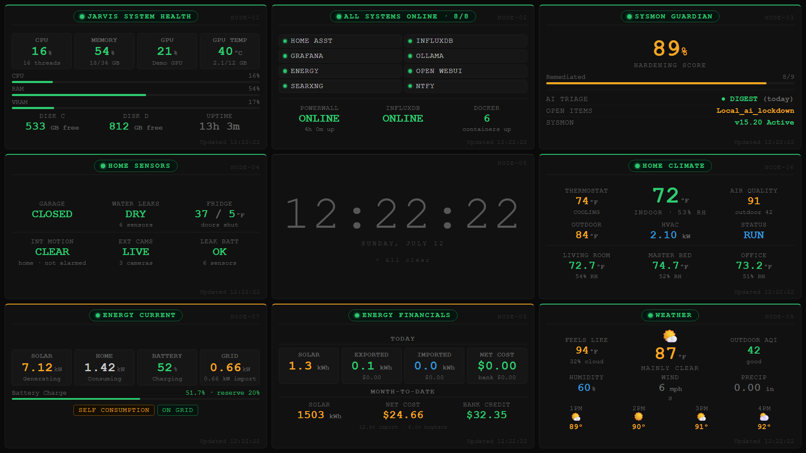

# JARVIS:5000



*Above: `?demo=1` — nine tiles, zero backend. This exact image is reproducible; see [Regenerating the screenshot](#regenerating-the-screenshot).*

**A single-file, always-on wall dashboard for a self-hosted home.**
Nine tiles, no scrolling, no header, no chrome — and a centre tile that stays out of
your way until something actually needs you.

```
┌─────────────────┬─────────────────┬─────────────────┐
│ SYSTEM HEALTH   │ SERVICES        │ SECURITY POSTURE│
├─────────────────┼─────────────────┼─────────────────┤
│ HOME SENSORS    │   ★ PUSH ★     │ HOME CLIMATE    │
├─────────────────┼─────────────────┼─────────────────┤
│ ENERGY CURRENT  │ ENERGY FINANCE  │ WEATHER         │
└─────────────────┴─────────────────┴─────────────────┘
```

**See it in 5 seconds, with no backend at all:**

```bash
git clone https://github.com/LimitedEnergyX/jarvis-5000
cd jarvis-5000
node server.js
# → http://localhost:5000/?demo=1
```

`?demo=1` renders the whole dashboard on mock data. No InfluxDB, no Home Assistant,
no config. Look first, wire it up later.

---

## What this is (and isn't)

This is **one component** of a larger self-hosted home platform — the part you bolt to
the wall. The platform behind it runs a local AI stack (Ollama, Open WebUI, SearXNG),
Home Assistant, InfluxDB + Grafana, a Sysmon → security-triage pipeline, solar/battery
monitoring, and ntfy for push. **None of that lives in this repo.**

What lives here is the **dashboard and the pattern**: how to render it, how to make it
survive a reboot, how to keep it honest when a sensor lies to you.

**Treat it as a springboard, not a product.** Take the tiles that map to your house,
delete the ones that don't, rewrite the ones that nearly fit. The alert engine and the
"no-scroll, fits-any-screen" layout are the genuinely reusable parts. Your entity IDs
are not mine, and your fridge probably reports on a different schedule than mine does.

It is deliberately **vanilla**: one HTML file, one config file, a small zero-dependency
Node server. No build step, no framework, no npm install. You can read the whole thing.

---

## Requirements

| | |
|---|---|
| **Required** | Node 18+ (for the static server). That's it. |
| **For live data** | InfluxDB 2.x, and Home Assistant writing into it via the [`influxdb` integration](https://www.home-assistant.io/integrations/influxdb/) |
| **Optional** | An energy/solar API (see [`docs/API-CONTRACT.md`](docs/API-CONTRACT.md)) · a `sysmon` bucket for NODE-03 |

If you have none of that, `?demo=1` still works.

---

## Setup

```bash
cp config.example.js config.js
```

Then edit `config.js`: your host, a **read-only** InfluxDB token, and your entity IDs.
Find those in Home Assistant → **Developer Tools → States**.

```bash
node server.js     # → http://localhost:5000
```

`config.js` is **gitignored by default** — that is why config lives outside `index.html`.
It is a sensible default, not a guarantee: `git add -f` still works, and adding an ignore
rule after the fact does not remove a secret that is already in your history. Check
`git status` before you commit.

---

## Running it safely

This is built for a **LAN**. It is not an internet-facing application, and none of what
follows is exotic advice — it is just what "local dashboard" means:

- **Don't port-forward the Node server to the internet.** There is no authentication, by
  design. It assumes everyone who can reach it is already inside your house.
- **Use a dedicated read-only InfluxDB token.** The dashboard never writes. Don't paste an
  all-access admin token into a file the browser downloads.
- **`config.js` is delivered to the browser.** Anyone who can load the live dashboard can
  open devtools and read your token, host and entity IDs. That is inherent to a no-backend
  design — it's fine on a home LAN, and it is exactly why the token should be read-only.
- **`?demo=1` needs no credentials and no backend services.** Safe to open anywhere, and
  safe to hand to someone who just wants to look.
- **Customize the entity IDs.** The values in `config.example.js` are placeholders shaped
  like real ones. Remove or disable the tiles that don't map to hardware you actually own.

---

## The nine tiles

| Tile | Source |
|---|---|
| **System Health** — CPU · RAM · GPU · disk | `/api/system` (Node `os` + `nvidia-smi`) |
| **Services & Status** — reachability + Docker daemon | pings + `/api/docker` |
| **Security Posture** — hardening score, open items | InfluxDB `sysmon` bucket *(optional)* |
| **Home Sensors** — garage · leaks · fridge · motion | InfluxDB `homeassistant` bucket |
| **★ Push tile** — the centre | *see below* |
| **Home Climate** — thermostat · AQI · room temps | InfluxDB `homeassistant` bucket |
| **Energy Current** — solar · battery · grid | your energy API |
| **Energy Financials** — cost, export credit | your energy API |
| **Weather** — current + hourly + outdoor AQI | your energy API + Influx |

---

## The push tile (the point of the whole thing)

A wall display that shows everything all the time is wallpaper. You stop seeing it.

So the centre tile is **empty by default** — just a dimmed clock. When something needs
you, it takes the tile over. With multiple issues it **cycles every 3 seconds**, and the
clock is one of the slots:

```
2 issues →  issue1 · issue2 · CLOCK · issue1 · issue2 · CLOCK · …
1 issue  →  issue1 · CLOCK · issue1 · CLOCK · …
0 issues →  CLOCK (held)
```

The clock slot shows `◦ 2 OPEN ISSUES` while anything is outstanding, so it never says
"All clear" when it isn't.

| Severity | Fires on |
|---|---|
| **critical** (red, pulsing) | Doorbell · water leak · grid down · Docker daemon down |
| **warn** (amber) | Front-door motion · garage left open · service down · fridge too warm |
| **info** (blue) | Other cameras · fridge door open |

**Camera motion fills the tile with a live snapshot**, alert text over a scrim,
refreshing every 2s. See [`docs/CAMERA-SNAPSHOTS.md`](docs/CAMERA-SNAPSHOTS.md) — you
do **not** need a Home Assistant token for this.

### Two design decisions worth stealing

**Interior motion is not an alert.** Presence sensors (smart speakers, PIRs) fire
constantly while you're home. That's just you walking around. Push it to the centre tile
and you'll be trained to ignore the centre tile inside a week — which destroys the one
thing it's for. It's displayed, never alerted. Flip `alerts.awayMode` (or wire it to a
presence entity) and the same sensors become a critical intruder alert.

**Battery-at-reserve is not an alert.** It's normal self-consumption behaviour. Alerting
on normal states is how dashboards become noise.

---

## Reboot survival

A wall display nobody logs into has failure modes a laptop dashboard never sees.
[`ops/`](ops/) has the pieces:

- **`kiosk-autostart.ps1`** — registers the server + a full-screen Chrome kiosk at logon.
  **The server starting is not the same as the dashboard being on screen** — you need
  both, and it's easy to ship one and forget the other.
- **`boot-guard.example.ps1`** — a crash-restart supervisor that waits for its dependencies
  (disk, DNS) before starting, and **redirects child output straight to files**.
- **`reclaim-console.ps1`** — RDP steals the console session and leaves the wall at a lock
  screen. This hands it back on disconnect.

### The bug that cost me a day

The original boot guard piped its child's `stdout` through PowerShell reader threads.
When a reader stalls, the ~4 KB OS pipe buffer fills, **the child blocks on `console.log`**,
and its event loop freezes. The process looks alive. The port shows `LISTENING`. It accepts
nothing — IPv4, IPv6, LAN, all of it. And because the task ran as SYSTEM, no user shell
could kill it.

It died every 10–17 minutes for days.

**Never pipe a long-running child's stdout through a supervisor you wrote.** Redirect to
a file and let the OS deal with it.

---

## Display scaling

Root font is `clamp(11px, 2vh, 46px)` and **everything** is in `rem`. The grid is exactly
three rows of `100vh`, so tile height and type size are locked to one variable and the deck
scales as a unit.

Verified with **zero clipping** at **1920×1080** and **3840×2160 (4K)** — the two that
matter for a wall panel. It scales continuously rather than to a list of breakpoints, so
sizes in between work too, but those two are what's actually tested.

### On a phone

The no-scroll rule cannot survive a 390px screen — nine tiles would be ~90px
tall. Below 640px the deck deliberately breaks its own invariant: single column,
auto height, vertical scroll, and the push tile pulled to the **top** (an alert
tile five swipes down the page is not an alert tile). Tablets get two columns.
All of it is inside media queries; the wall never sees any of it.

Two traps, both of which bit this file:

- The responsive rules must sit at the **end** of the stylesheet. Breakpoints
  near the top did nothing for months, because the kiosk block re-declared
  `.dash` below them and won on source order.
- Grid items default to `min-width: auto` and **refuse to shrink below their
  content**. The `white-space: nowrap` that keeps columns on a straight baseline
  at 4K makes the whole *page* wider than a phone. `min-width: 0` plus re-allowing
  wrap; either alone still overflows.

**There is no scrolling anywhere, by design** — it's bolted to a wall; nobody can scroll it.
If you add content, verify it still fits:

```js
// paste in devtools — expect []
Array.from(document.querySelectorAll('.panel')).map(p => {
  const f = p.querySelector('.fill') || p.querySelector('.push-body');
  const o = f.scrollHeight - f.clientHeight;
  const n = (p.querySelector('.pill-txt')||{}).textContent || p.id;
  // 2px of slack: the panels have fractional heights (rem on a vh-derived
  // root), and an emoji glyph can overshoot its line box on an
  // overflow:visible container. Both inflate scrollHeight without anything
  // actually being cut off. Real clipping is tens of px, not two.
  return o > 2 ? `${n.trim()} CLIPPED +${o}px` : null;
}).filter(Boolean);
```

A single hardcoded `px` will break at 4K. Keep it in `rem`.

---

## Self-update

`/api/health` returns a build id (the mtime of `index.html`). The dashboard polls it every
15s and **reloads itself when the file changes**. A wall display nobody touches can't sit
on stale code — and you will absolutely forget to refresh it otherwise.

---

## Hard-won lessons

These cost real debugging time. They're in here so they don't cost you any.

### 1. Match the query window to the sensor's cadence — not your poll interval

Bit me **five separate times**, each looking like a different bug:

| Symptom | Actual cause |
|---|---|
| Security triage always "N/A" | Queried 15 min. It runs **nightly**. |
| A room temp kept vanishing | Queried 1h. That sensor reports every **~90 min**. |
| Fridge showed `—°F` | Queried 6h. It reports **on change only** — a steady 37°F is silent for hours. |
| Camera motion looked "stale" | `event.*` entities only update on **actual motion**. |
| Weather showed an hour already past | A 1h "grace window" let a gone hour through. |

Where a slow sensor could hide a real failure, **show the staleness**. The fridge greys out
and prints `stale` after 48h of silence rather than passing an old number off as current.

### 2. A hardcoded error string in a `catch` is worse than no message

Two tiles printed *"CORS Blocked"* regardless of the actual error. One was really
`unsupported aggregate column type string` — a measurement with no numeric field, being
fed to `mean()`. I chased CORS twice. **Print the real error.**

### 3. Same word, opposite meaning

An indoor air-quality monitor reports a 0–100 **score** (higher = better). An outdoor
sensor reports **EPA AQI** (lower = better). Both are called "AQI". Colour them the same
way and your dashboard is confidently lying. `config.js` declares the scale per sensor.

### 4. Two sensors can measure the same electricity

The deck summed a heat pump's "indoor power" and "outdoor power" and reported
**2.11 kW of HVAC inside a 1.66 kW house**. The indoor sensor wasn't the air
handler — it was a second accounting of the same compressor energy.

It looked completely plausible for months. It only broke when it was put next to
a number that could contradict it: the Powerwall's whole-house load.

**Give every derived number something that can disprove it.** HVAC is a subset of
the house, so HVAC > house is impossible — that single inequality caught it.
Physical impossibility is the cheapest test you own, and it needs no datasheet.

### 5. If two dashboards score the same data, they must agree

A Grafana gauge said the security posture was **98%**. This deck said **95%**.
Same 20 rows, two formulas. Both bugs were here: a 24-hour window that silently
dropped quiet items out of the *denominator*, and binary scoring that treated
"mitigated, still watching" as a total failure.

A dashboard that argues with your other dashboard is worse than no dashboard —
you stop trusting both, including the one that was right.

### 6. `localhost` is not a hostname, it's a perspective

Hardcoding `localhost:3002` worked perfectly in the kiosk and broke the instant the
dashboard was opened from another machine — where `localhost` is the *viewing* device.
Everything is derived from `location.hostname` now.

---

## Repo layout

```
index.html            the whole dashboard — HTML + CSS + JS
config.example.js     copy to config.js (gitignored)
demo.js               ?demo=1 mock data
server.js             static server + /api/system + /api/docker + /api/health
ops/                  kiosk autostart · boot guard · console reclaim
docs/                 API contract · camera snapshots · hero.png
.gitignore            ignores config.js by default
LICENSE               MIT
```

---

## Regenerating the screenshot

The image at the top of this file is not a hand-cropped artifact — it is a deterministic
render, so it can be rebuilt after a layout change instead of quietly drifting out of date.

`?freeze=HH:MM:SS` pins the push tile to the clock frame, clears the alert state, and
stamps every `Updated` line with the same time, so two runs produce comparable output:

```powershell
chrome.exe --headless=new --disable-gpu --hide-scrollbars `
  --window-size=1920,1080 --force-device-scale-factor=1 `
  --virtual-time-budget=12000 `
  --screenshot="docs/hero.png" `
  "http://localhost:5000/index.html?demo=1&freeze=12:22:22"
```

`freeze` only accepts a literal 24-hour time (`HH:MM:SS`) and only does anything alongside
`demo`. Anything else is ignored.

---

## Contributing

Fork it, gut it, make it yours. If you build a tile that's generally useful, a PR is
welcome — but honestly, the more useful thing is to take the pattern and go.

MIT. Do what you like.
